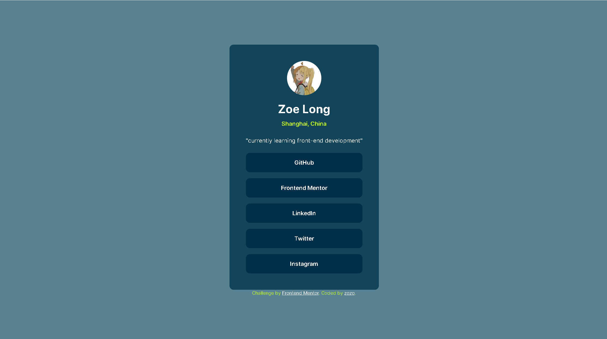

# Frontend Mentor - Social links profile solution

This is a solution to the [Social links profile challenge on Frontend Mentor](https://www.frontendmentor.io/challenges/social-links-profile-UG32l9m6dQ). Frontend Mentor challenges help you improve your coding skills by building realistic projects. 

## Table of contents

- [Overview](#overview)
  - [The challenge](#the-challenge)
  - [Screenshot](#screenshot)
- [My process](#my-process)
  - [Built with](#built-with)
  - [What I learned](#what-i-learned)
  - [Continued development](#continued-development)
  - [Useful resources](#useful-resources)
- [Author](#author)

## Overview

### The challenge

Users should be able to:

- See hover and focus states for all interactive elements on the page

### Screenshot



### Links

- Live Site URL: [live site URL](https://lll0908.github.io/social-links-profile_Frontend-mentor/)

## My process

### Built with

- Semantic HTML5 markup
- CSS custom properties
- Flexbox

### What I learned

I learned how to control the size and shape of image by using the background.

```css
.profile-photo {
    width: 6em;
    height: 6em;
    margin: 0 auto;
    border-radius: 50%;
    background-image: url("cute.jpg");
    background-repeat: no-repeat;
    background-position: top;
    background-size: cover;
}
```

### Continued development
keep learning

### Useful resources

- [color](https://coolors.co/palettes/trending) - This helped me for choosing the color.

## Author

- Frontend Mentor - [@LLL0908](https://www.frontendmentor.io/profile/LLL0908)

